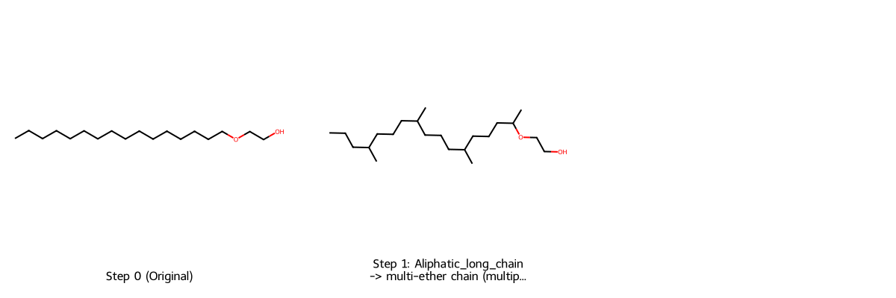
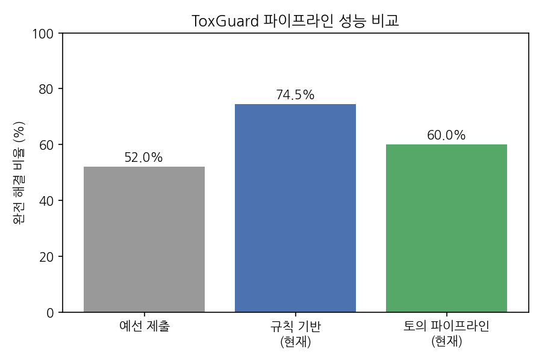

# ToxGuard 프로젝트 요약

RDKit 규칙 기반 독성구조(toxicophore) 진단과 LLM 기반 검증을 결합한
분자 치환 파이프라인. JUMP AI 2026 공모전(팀명 MorForge) 제출작을
기반으로 지속 개발 중이며, GitHub에 공개되어 있다.
(github.com/Dec32th/laidd-2026)

## 문제 의식과 접근

신약 후보 물질은 종종 독성 위험이 있는 구조(toxicophore)를 포함한다.
이를 자동으로 진단하고 화학적으로 타당하게 치환하는 것이 목표이나,
단순 구조 치환만으로는 실제 약효(활성)를 해치거나, 반대로 그 구조
자체가 약효의 핵심인 경우(예: 니트로푸란토인의 니트로기)를 구분하지
못한다는 문제가 있다. ToxGuard는 이 판단을 다음 세 층위로 나눠
해결한다.

1. **진단**: BRENK/PAINS 규칙(FilterCatalog)으로 독성구조 탐지
2. **치환 후보 생성**: 규칙별 치환 라이브러리(42개 규칙, 27건의
   ChEMBL/Guide to Pharmacology 실조회 기반 선례)에서 candidate 생성
3. **LLM 검증**: 승인약물 사례와 유사할 가능성이 있는 candidate는
   LLM(Qwen) proposer-critic 토의로 재검토. 단백질 도킹(AutoDock
   Vina/Meeko), 합성용이성(SA Score), 활성보존 지표를 판단 근거로
   제공하고, 모든 판단(승인/반려/에스컬레이트)을 감사추적 형태로 기록

## 실행 예시

긴 지방족 사슬(Aliphatic_long_chain) 구조를 진단하고, 메틸 분기
전략으로 치환해 문제를 해소하는 과정. BRENK 필터의 실제 SMARTS
정의가 원소 종류와 무관한 순수 위상학적 패턴임을 직접 분석으로
확인하고 전략을 설계했다.

## 최종 수치

| | 완전 해결 비율 |
|---|---|
| 공모전 예선 제출 | 52.0% |
| 규칙 기반 파이프라인 (valid set 1173개) | 74.5% |
| LLM 토의 포함 파이프라인 (표본 200개) | 약 60% |

토의 파이프라인의 수치가 낮은 것은 성능 저하가 아니라 설계된
트레이드오프다. 화학적으로 의심스러운 자동 치환을 막아 표면적
성공률은 낮아지지만, 각 성공의 신뢰도는 올라간다. 실제로 이 수치
차이의 원인을 추적한 결과(아래), 상당 부분이 LLM이 활성에 필수적인
구조(예: 니트로푸란토인과 동일한 니트로푸란 골격)를 정확히 감지해
치환을 보류시킨, 의도된 보수적 판단으로 확인되었다.

## 방법론적으로 흥미로운 발견들

개발 과정에서 반복적으로 나타난 패턴: 비교 실험이나 정량적 검증이
성능을 확인하는 데서 그치지 않고, 시스템 자체의 숨은 결함을
발견하는 도구로 기능했다.

- **LLM 근거 오귀속 발견**: 도킹 검증 결과를 LLM(critic) 판단 근거로
  제공했을 때, 그 도킹이 실제로는 무관한 벤치마크 표적이었음에도
  "이 분자는 이 표적을 겨냥한다"고 잘못 단정하는 시스템적 편향을
  발견. 표적 특이성 근거 유무를 명시하는 caveat 필드로 수정
- **엔진 결함 발견**: 규칙기반 vs LLM 우선순위 판단을 비교하던 중,
  LLM이 우세해 보였던 격차의 상당 부분이 실은 규칙기반 엔진 자체의
  재시도 로직 부재 때문이었음을 발견하고 수정
- **최근 재발견 사례**: 최종 수치를 재검증하는 과정에서 완전해결
  비율이 예상(67~70%)보다 낮게(약 60%) 나온 원인을 추적한 결과,
  다중문제 처리 순서를 정하는 그리디 로직이 LLM 토의 모드에서는
  완전히 무시되고 있던 구조적 결함을 발견해 수정. 수정 후에도
  남은 차이는 LLM이 활성 필수 구조를 정확히 인식해 치환을 보류
  시키는, 설계 의도대로의 보수적 판단임을 확인

## 알려진 한계와 다음 확장 방향

- `phosphor` 규칙(BRENK)이 인(P) 원자를 포함하는 서로 다른 세 화학종
  (포스페이트 트리에스터, 포스파이트, 포스핀 옥사이드)을 하나로
  묶고 있어, stuck 사례의 최다 원인(67건)으로 확인됨. 각 화학종에
  맞는 치환 전략을 새로 설계하는 것이 다음 확장 우선순위
- LLM 판단의 비결정성(같은 입력에도 판정이 달라짐)을 완화하는
  self-consistency(다수결) 기능은 구현했으나, 소규모 검증에서는
  효과를 통계적으로 증명하지 못해 기본값은 비활성 상태로 유지
- 공유결합 억제제(예: EGFR 표적 오시메르티닙)의 결합력은 표준
  도킹으로 평가할 수 없다는 방법론적 한계를 발견, Meeko+
  AutoDock-GPU 기반 tethered docking으로 근본 해결에 성공했으나
  (오시메르티닙 -5.31 vs 이타콘산 +7.06 kcal/mol) 운영 비용
  문제로 상시 파이프라인에는 미통합

## 저장소 안내

- 전체 코드 및 개발 이력: github.com/Dec32th/laidd-2026
- 프로젝트 개요: docs/README.md
- 전체 개발 이력(노트북 1-66): docs/CHANGELOG.md
- 방법론적 발견 사례 모음: docs/discovery_patterns.md
- 알려진 한계 전체 기록: docs/limitations.md
- 인터랙티브 데모(Gradio): notebooks/65_gradio_interface.ipynb